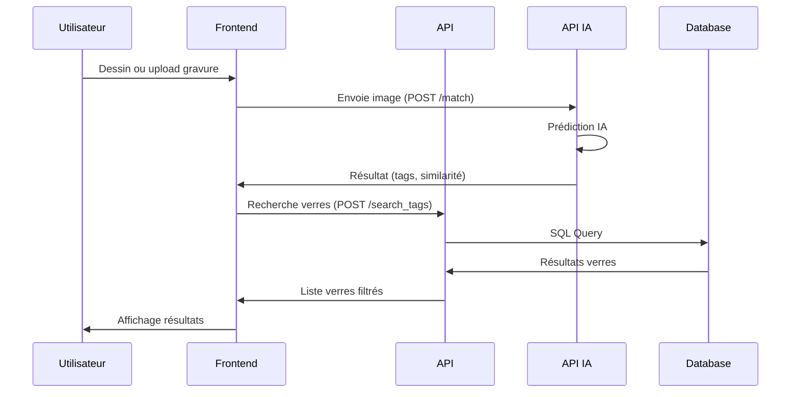
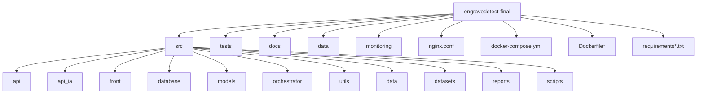

# 🔍 EngraveDetect

Application web intelligente pour la détection et l'analyse des gravures nasales sur les verres optiques.


## 📋 Vue d'ensemble

EngraveDetect est une solution complète pour l’identification, l’analyse et la gestion des verres optiques à partir de leurs gravures. Elle combine une interface web moderne, une API sécurisée, des modèles IA performants et une infrastructure cloud robuste.

### Architecture du système
```mermaid
graph TD
    A[Utilisateur] --> B[Frontend (HTML/CSS/JS)]
    B --> C[API FastAPI]
    B --> D[API IA FastAPI]
    C --> E[(Azure SQL)]
    D --> F[PyTorch EfficientNet]
    C --> G[JWT Service]
    C --> H[Prometheus]
    H --> I[Grafana]
```

### Flux de données principal


### Structure du projet


## � Démarrage rapide

### Prérequis
- Python 3.10+
- Docker & Docker Compose
- Git
- Compte Azure (pour la base SQL)

### Installation & Lancement
1. **Cloner le dépôt**
   ```bash
   git clone https://github.com/votre-username/engravedetect-final.git
   cd engravedetect-final
   ```
2. **Configurer l’environnement**
   ```bash
   python -m venv venv
   source venv/bin/activate  # Linux/Mac
   # ou
   .\venv\Scripts\activate   # Windows
   pip install -r requirements.txt
   pip install -r requirements-dev.txt
   ```
3. **Variables d’environnement**
   - Copie le fichier `.env` fourni (ou crée-le à partir de `.env.example` si présent).
   - Renseigne les accès Azure, clés JWT, etc. **Ne jamais commiter de secrets !**
4. **Lancer l’application**
   ```bash
   docker-compose up --build
   ```
   - Frontend : http://localhost (ou http://<IP_VM>)
   - API : http://localhost:8000
   - API IA : http://localhost:8001
   - Prometheus : http://localhost:9090
   - Grafana : http://localhost:3001


## 🛠️ Technologies principales
- **Frontend** : HTML5, CSS3, JS (vanilla, sans framework)
- **Backend** : Python, FastAPI, SQLAlchemy
- **IA/ML** : PyTorch, EfficientNet, OpenCV
- **Base de données** : Azure SQL
- **DevOps** : Docker, NGINX, Prometheus, Grafana, GitHub Actions
- **Tests** : Pytest, Coverage

## 📚 Documentation
La documentation complète (API, sécurité, CI/CD, MLOps, RGPD, etc.) est dans le dossier [`docs/`](docs/).
Quelques fichiers clés :
- [`docs/C5_API_REST.md`](docs/C5_API_REST.md) : Spécification de l’API REST principale
- [`docs/C9_API_IA.md`](docs/C9_API_IA.md) : Spécification de l’API IA
- [`docs/C13_MLOps_Pipeline.md`](docs/C13_MLOps_Pipeline.md) : Pipeline MLOps
- [`docs/README_CI_CD.md`](docs/README_CI_CD.md) : CI/CD & déploiement
- [`docs/C4_Base_Donnees_RGPD.md`](docs/C4_Base_Donnees_RGPD.md) : RGPD & sécurité des données

## 🧪 Tests
```bash
# Activer l’environnement virtuel
source venv/bin/activate
# Lancer tous les tests
pytest
# Couverture
pytest --cov=src tests/
# Tests spécifiques
pytest tests/api/
```

## 🔒 Sécurité & bonnes pratiques
- **Aucun secret ne doit être commité** : utilise `.env` (jamais versionné) pour toutes les clés, tokens, accès Azure, etc.
- **CSP stricte** : la configuration NGINX applique une politique CSP sans `unsafe-inline` ni wildcard.
- **Pas de JS/CSS inline** : tout le code front respecte la politique CSP.
- **Authentification JWT** : toutes les routes sensibles sont protégées.
- **Headers de sécurité** : voir `nginx.conf` et la doc sécurité.
- **Tests ZAP/OWASP** : l’application passe les scans sans alerte critique.

## 🤝 Contribution
1. Fork le projet
2. Crée une branche (`git checkout -b feature/ma-feature`)
3. Commit tes changements (`git commit -m 'feat: ma feature'`)
4. Push sur ta branche (`git push origin feature/ma-feature`)
5. Ouvre une Pull Request

## 📝 Licence
Ce projet est sous licence MIT. Voir le fichier [LICENSE](LICENSE) pour plus de détails.

## 📞 Support
Pour toute question ou problème :
- Ouvre une issue sur GitHub
- Contacte l’équipe technique : support@engravedetect.com

## 🙏 Remerciements
- Tous les contributeurs
- La communauté open source
- Nos partenaires et clients