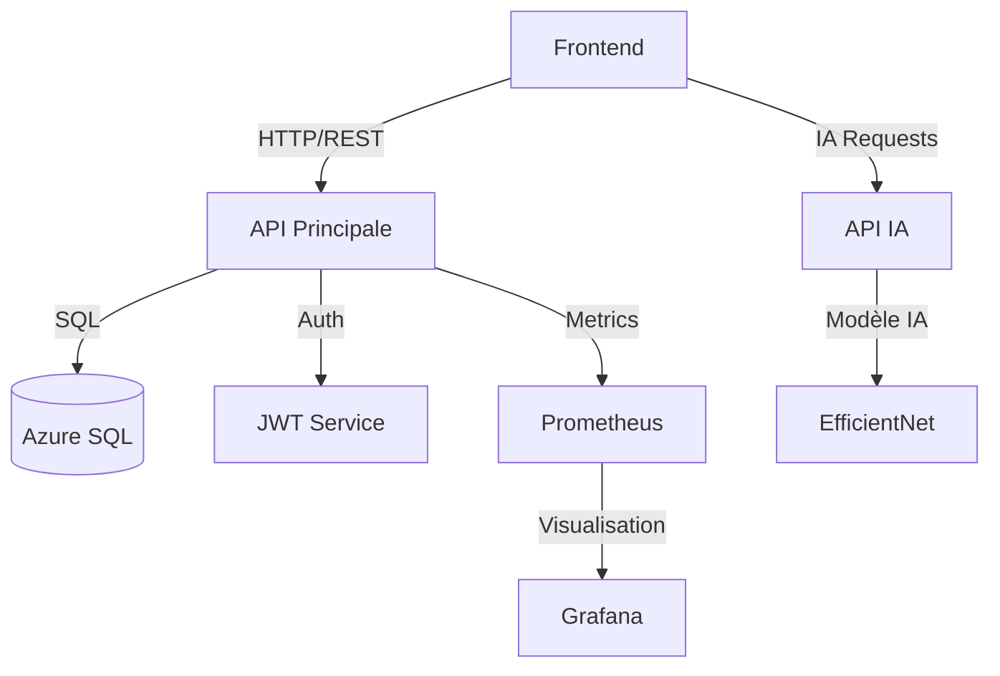
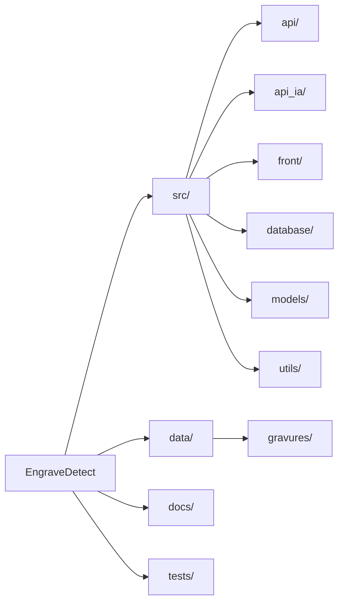
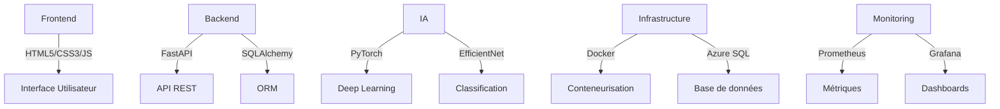
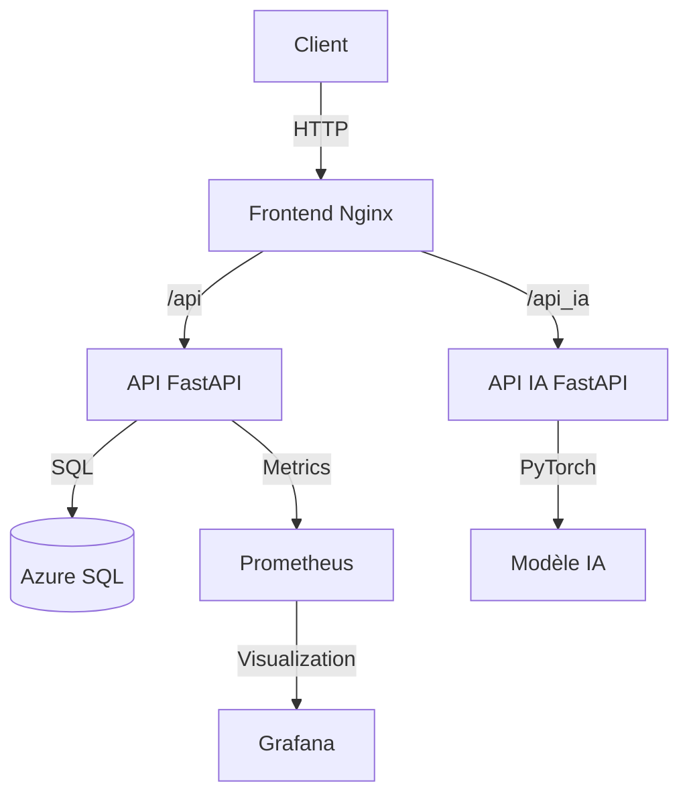
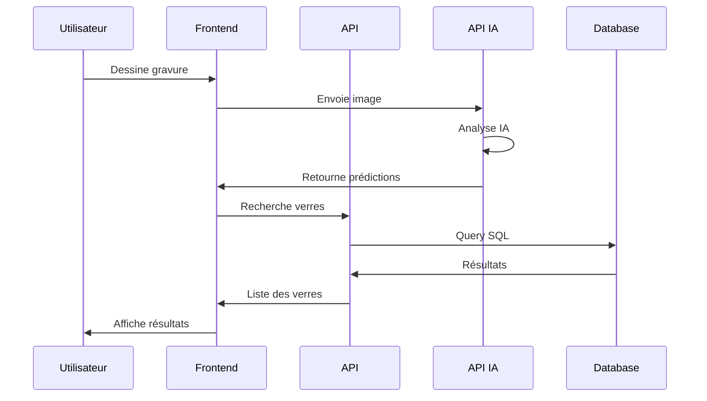

# 🔍 EngraveDetect

Application web intelligente pour la détection et l'analyse des gravures nasales sur les verres optiques.

## 📋 Vue d'ensemble

EngraveDetect est une solution complète qui permet aux professionnels de l'optique d'identifier et d'analyser les verres optiques à partir de leurs gravures nasales. Le système combine une interface utilisateur intuitive avec des modèles d'intelligence artificielle avancés pour une identification précise et rapide.

### Architecture du Système



### Structure du Projet



## 🚀 Fonctionnalités Principales

- 🎨 Interface de dessin intuitive pour reproduire les gravures
- 🤖 Modèle IA (EfficientNet) pour la reconnaissance des gravures
- 🏷️ Système de tags pour affiner les recherches
- 📊 Visualisation des résultats avec scores de confiance
- 🔒 Authentification sécurisée (JWT)
- 📈 Monitoring en temps réel (Prometheus/Grafana)

## 🛠️ Technologies Utilisées

### Stack Technique



## 🏗️ Installation

### Prérequis

- Python 3.10+
- Docker et Docker Compose
- Compte Azure (pour la base de données)
- Git

### Configuration

1. **Cloner le repository**
   ```bash
   git clone https://github.com/votre-username/engravedetect-final.git
   cd engravedetect-final
   ```

2. **Créer l'environnement virtuel**
   ```bash
   python -m venv engravedetect-env
   source engravedetect-env/bin/activate  # Linux/Mac
   # ou
   .\engravedetect-env\Scripts\activate  # Windows
   ```

3. **Installer les dépendances**
   ```bash
   pip install -r requirements.txt
   ```

4. **Configuration des variables d'environnement**
   ```bash
   cp .env.example .env
   # Éditer .env avec vos paramètres
   ```

### Démarrage

```bash
# Lancer avec Docker Compose
docker-compose up --build

# Services disponibles sur :
# - Frontend : http://localhost:80
# - API : http://localhost:8000
# - API IA : http://localhost:8001
# - Prometheus : http://localhost:9090
# - Grafana : http://localhost:3001
```

## 📚 Documentation

### Architecture des Services



### Flux de Données



## 🧪 Tests

```bash
# Activer l'environnement virtuel
source engravedetect-env/bin/activate

# Lancer tous les tests
pytest

# Tests avec couverture
pytest --cov=src tests/
```

## 🔒 Sécurité

- Authentification JWT avec refresh tokens
- Rate limiting sur les endpoints sensibles
- Validation des entrées utilisateur
- Protection CORS configurée
- Logging sécurisé des accès

## 📈 Monitoring

- Métriques système via Prometheus
- Dashboards Grafana personnalisés
- Alerting configuré
- Logs centralisés

## 🤝 Contribution

1. Fork le projet
2. Créer une branche (`git checkout -b feature/AmazingFeature`)
3. Commit les changements (`git commit -m 'Add AmazingFeature'`)
4. Push sur la branche (`git push origin feature/AmazingFeature`)
5. Ouvrir une Pull Request

## 📝 Licence

Ce projet est sous licence MIT. Voir le fichier [LICENSE](LICENSE) pour plus de détails.

## 📞 Support

Pour toute question ou problème :
- Ouvrir une issue sur GitHub
- Contacter l'équipe technique : support@engravedetect.com 