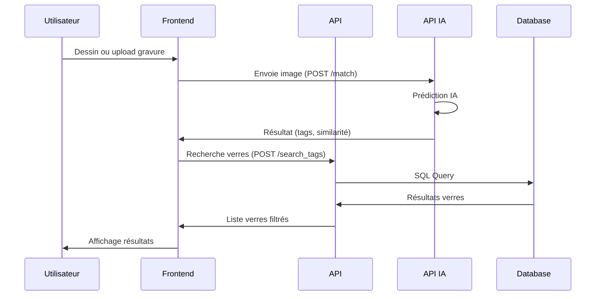

# 🔍 EngraveDetect

Application web intelligente pour la détection et l'analyse des gravures nasales sur les verres optiques.

---

## 📋 Vue d'ensemble

EngraveDetect est une solution complète pour l'identification, l'analyse et la gestion des verres optiques à partir de leurs gravures. Elle combine une interface web moderne, une API sécurisée, des modèles IA performants et une infrastructure cloud robuste.

### Flux de données principal


### Structure du projet
```
engravedetect-final/
├── src/
│   ├── api/              # API principale (FastAPI)
│   ├── api_ia/           # API IA (classification, embeddings)
│   ├── front/            # Interface utilisateur
│   ├── data/             # Scripts de traitement des données
│   ├── database/         # Modèles et migrations
│   ├── models/           # Modèles IA
│   ├── orchestrator/     # Pipeline de données
│   ├── scripts/          # Scripts utilitaires
│   └── utils/            # Utilitaires
├── tests/                # Tests automatisés
├── docs/                 # Documentation complète
├── data/                 # Données et images
├── monitoring/           # Configuration monitoring
├── docker-compose.yml    # Orchestration Docker
├── Dockerfile*           # Images Docker
└── requirements*.txt     # Dépendances Python
```

---

## 🚀 Démarrage rapide

### Prérequis
- Python 3.12+
- Docker & Docker Compose
- Git
- Compte PostgreSQL (ou SQLite pour le développement)

### Installation & Lancement
1. **Cloner le dépôt**
   ```bash
   git clone https://github.com/votre-username/engravedetect-final.git
   cd engravedetect-final
   ```

2. **Configurer l'environnement**
   ```bash
   python -m venv venv
   source venv/bin/activate  # Linux/Mac
   # ou
   .\venv\Scripts\activate   # Windows
   pip install -r requirements.txt
   pip install -r requirements-dev.txt
   ```

3. **Variables d'environnement**
   - Copie le fichier `.env` fourni (ou crée-le à partir de `.env.example` si présent).
   - Renseigne les accès base de données, clés JWT, etc. **Ne jamais commiter de secrets !**

4. **Lancer l'application**
   ```bash
   docker-compose up --build
   ```
   - Frontend : http://localhost (ou http://<IP_VM>)
   - API : http://localhost:8000
   - API IA : http://localhost:8001
   - Prometheus : http://localhost:9090
   - Grafana : http://localhost:3001

---

## 🛠️ Technologies principales
- **Frontend** : HTML5, CSS3, JavaScript (vanilla)
- **Backend** : Python 3.12, FastAPI, SQLAlchemy
- **IA/ML** : PyTorch, EfficientNet, OpenCV
- **Base de données** : PostgreSQL (production), SQLite (développement)
- **DevOps** : Docker, NGINX, Prometheus, Grafana, GitHub Actions
- **Tests** : Pytest, Playwright (E2E)

---

## 📚 Documentation
La documentation complète est dans le dossier [`docs/`](docs/).

### Fichiers clés :
- [`docs/C1_Automatisation_Extraction_Donnees.md`](docs/C1_Automatisation_Extraction_Donnees.md) : Pipeline d'extraction de données
- [`docs/C3_Agregation_Donnees.md`](docs/C3_Agregation_Donnees.md) : Agrégation et traitement des données
- [`docs/C5_API_REST.md`](docs/C5_API_REST.md) : API REST principale
- [`docs/C9_API_IA.md`](docs/C9_API_IA.md) : API IA
- [`docs/C13_MLOps_Pipeline.md`](docs/C13_MLOps_Pipeline.md) : Pipeline MLOps
- [`docs/C4_Base_Donnees_RGPD.md`](docs/C4_Base_Donnees_RGPD.md) : RGPD & sécurité
- [`docs/PLAYWRIGHT_GUIDE.md`](docs/PLAYWRIGHT_GUIDE.md) : Tests E2E

---

## 🧪 Tests
```bash
# Activer l'environnement virtuel
source venv/bin/activate

# Lancer tous les tests
pytest

# Couverture
pytest --cov=src tests/

# Tests spécifiques
pytest tests/api/
pytest tests/test_playwright_e2e.py -v

# Tests E2E avec Playwright
pytest tests/test_playwright_e2e.py --headed
```

---

## 🔒 Sécurité & bonnes pratiques
- **Aucun secret ne doit être commité** : utilise `.env` (jamais versionné) pour toutes les clés, tokens, accès base de données, etc.
- **CSP stricte** : la configuration NGINX applique une politique CSP sécurisée.
- **Authentification JWT** : toutes les routes sensibles sont protégées.
- **Headers de sécurité** : configuration sécurisée dans l'API.
- **Conformité RGPD** : gestion des données personnelles et droit à l'oubli.

---

## 🤝 Contribution
1. Fork le projet
2. Crée une branche (`git checkout -b feature/ma-feature`)
3. Commit tes changements (`git commit -m 'feat: ma feature'`)
4. Push sur ta branche (`git push origin feature/ma-feature`)
5. Ouvre une Pull Request

---

## 📝 Licence
Ce projet est sous licence MIT. Voir le fichier [LICENSE](LICENSE) pour plus de détails.

---

## 📞 Support
Pour toute question ou problème :
- Ouvre une issue sur GitHub
- Consulte la documentation dans le dossier `docs/`

---

## 🙏 Remerciements
- Tous les contributeurs
- La communauté open source
- Nos partenaires et clients