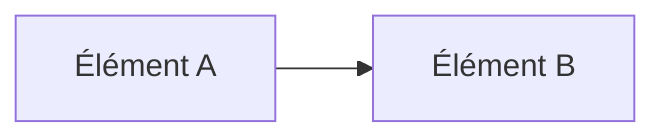

# Guide d'Accessibilité de la Documentation

## Contexte et Objectifs

Ce guide définit les standards d'accessibilité pour la documentation du projet EngraveDetect, conformément aux recommandations de l'association Valentin Haüy et de Microsoft. Il vise à rendre la documentation accessible à tous les utilisateurs, y compris ceux utilisant des technologies d'assistance.

---

## Standards de Conformité

### Référentiels
- **WCAG 2.1** (Web Content Accessibility Guidelines)
- **Recommandations Valentin Haüy** pour la documentation technique
- **Microsoft Accessibility Guidelines** pour la documentation
- **Section 508** (États-Unis)

### Niveaux de Conformité
- **Niveau A** : Conformité minimale
- **Niveau AA** : Conformité recommandée (objectif du projet)
- **Niveau AAA** : Conformité maximale

---

## Structure et Navigation

### 1. Table des Matières
**Obligatoire** pour tous les documents de plus de 2 pages.

**Format requis :**
```markdown
## Table des Matières
- [Section 1](#section-1)
- [Section 2](#section-2)
  - [Sous-section 2.1](#sous-section-21)
```

### 2. Hiérarchie des Titres
**Structure cohérente :**
- H1 (`#`) : Titre principal du document
- H2 (`##`) : Sections principales
- H3 (`###`) : Sous-sections
- H4 (`####`) : Paragraphes (éviter plus de 4 niveaux)

### 3. Liens d'Ancrage
**Format des ancres :**
- Utiliser des caractères ASCII uniquement
- Remplacer les espaces par des tirets
- Supprimer les caractères spéciaux
- Exemple : `#gestion-des-erreurs`

---

## Contenu Textuel

### 1. Lisibilité
**Critères :**
- **Niveau de lecture** : Bac+2 maximum
- **Longueur des phrases** : 20 mots maximum
- **Paragraphes** : 3-4 phrases maximum
- **Vocabulaire technique** : Défini au premier usage

### 2. Alternatives Textuelles
**Pour tous les éléments non-textuels :**
- **Images** : Attribut `alt` descriptif
- **Diagrammes** : Description textuelle complète
- **Graphiques** : Données tabulaires équivalentes
- **Code** : Explication du fonctionnement

### 3. Mise en Forme
**Bonnes pratiques :**
- **Gras** : Pour les termes importants uniquement
- **Italique** : Pour les exemples et citations
- **Listes** : Préférer les listes à puces numérotées
- **Citations** : Utiliser le format `>`

---

## Code et Exemples Techniques

### 1. Blocs de Code
**Format requis :**
```markdown
**Description du code :**

```language
code_example
```

*Explication : Description de ce que fait le code et pourquoi.*
```

### 2. Commandes Terminal
**Format requis :**
```markdown
**Commande pour [action] :**

```bash
commande_exemple
```

*Description : Explication de la commande et de ses paramètres.*
```

### 3. Exemples JSON/XML
**Format requis :**
```markdown
**Exemple de [type de données] :**

```json
{
  "exemple": "structure"
}
```

*Description : Explication de la structure et des champs.*
```

---

## Diagrammes et Visualisations

### 1. Diagrammes Mermaid
**Format préféré :**
```markdown
**Diagramme de [concept] :**



*Description : Explication textuelle complète du diagramme.*
```

### 2. Diagrammes ASCII (à éviter)
**Si nécessaire, fournir :**
- Description textuelle complète
- Version alternative en Mermaid
- Explication des symboles utilisés

### 3. Captures d'Écran
**Format requis :**
```markdown


*Description détaillée : Explication de ce que montre l'image et son contexte.*
```

---

## Formulaires et Interactions

### 1. Exemples de Requêtes
**Format requis :**
```markdown
**Requête [type] vers [endpoint] :**

```bash
curl -X METHOD http://endpoint/path \
  -H "Header: Value" \
  -d "data"
```

**Réponse attendue :**

```json
{
  "response": "example"
}
```

*Explication : Description de la requête, des paramètres et de la réponse.*
```

### 2. Authentification
**Format requis :**
```markdown
**Étape 1 : Authentification**

```bash
curl -X POST http://localhost:8001/token \
  -d "username=user&password=pass"
```

**Étape 2 : Utilisation du token**

```bash
curl -X GET http://localhost:8001/endpoint \
  -H "Authorization: Bearer TOKEN"
```

*Explication : Processus en étapes numérotées avec explications.*
```

---

## Contraste et Lisibilité

### 1. Couleurs
**Recommandations :**
- **Contraste** : Minimum 4.5:1 pour le texte normal
- **Contraste** : Minimum 3:1 pour le texte large
- **Éviter** : Utilisation de la couleur seule pour transmettre l'information

### 2. Typographie
**Recommandations :**
- **Taille** : Minimum 12pt (16px) pour le texte principal
- **Police** : Sans-serif (Arial, Verdana, etc.)
- **Interligne** : 1.5 minimum
- **Espacement** : 1.2 minimum entre les paragraphes

---

## Technologies d'Assistance

### 1. Lecteurs d'Écran
**Compatibilité :**
- **Structure sémantique** : Utiliser les balises appropriées
- **Navigation** : Liens d'ancrage fonctionnels
- **Alternatives** : Textes alternatifs pour tous les éléments non-textuels

### 2. Navigation au Clavier
**Fonctionnalités :**
- **Tabulation** : Ordre logique des éléments
- **Raccourcis** : Touches d'accès rapide documentées
- **Focus** : Indicateurs visuels de focus

### 3. Zoom et Redimensionnement
**Compatibilité :**
- **Zoom** : Fonctionnel jusqu'à 200%
- **Redimensionnement** : Texte reste lisible
- **Responsive** : Adaptation aux différentes tailles d'écran

---

## Tests d'Accessibilité

### 1. Tests Automatisés
**Outils recommandés :**
- **axe-core** : Tests WCAG automatiques
- **pa11y** : Tests d'accessibilité en ligne de commande
- **WAVE** : Extension navigateur pour tests rapides

### 2. Tests Manuels
**Checklist :**
- [ ] Navigation au clavier fonctionnelle
- [ ] Lecteur d'écran compatible
- [ ] Contraste suffisant
- [ ] Alternatives textuelles présentes
- [ ] Structure sémantique correcte

### 3. Tests Utilisateurs
**Méthodes :**
- **Tests avec utilisateurs** : Personnes utilisant des technologies d'assistance
- **Feedback** : Recueil des retours d'expérience
- **Amélioration continue** : Mise à jour basée sur les retours

---

## Maintenance et Mise à Jour

### 1. Révision Périodique
**Fréquence :**
- **Révision mensuelle** : Vérification de la conformité
- **Mise à jour trimestrielle** : Adaptation aux nouvelles recommandations
- **Audit annuel** : Évaluation complète de l'accessibilité

### 2. Formation
**Objectifs :**
- **Sensibilisation** : Importance de l'accessibilité
- **Formation technique** : Outils et méthodes
- **Bonnes pratiques** : Intégration dans le workflow

### 3. Documentation
**Maintien :**
- **Standards** : Mise à jour des référentiels
- **Exemples** : Ajout de nouveaux cas d'usage
- **Outils** : Évolution des technologies d'assistance

---

## Ressources et Références

### 1. Standards Officiels
- [WCAG 2.1 Guidelines](https://www.w3.org/WAI/WCAG21/quickref/)
- [Microsoft Accessibility Guidelines](https://docs.microsoft.com/en-us/accessibility/)
- [Section 508 Standards](https://www.section508.gov/)

### 2. Outils de Test
- [WAVE Web Accessibility Evaluator](https://wave.webaim.org/)
- [axe-core](https://github.com/dequelabs/axe-core)
- [pa11y](https://pa11y.org/)

### 3. Associations
- [Association Valentin Haüy](https://www.avh.asso.fr/)
- [Web Accessibility Initiative (WAI)](https://www.w3.org/WAI/)

---

## Contact et Support

### Questions d'Accessibilité
Pour toute question concernant l'accessibilité de la documentation :
- **Email** : accessibility@engravedetect.com
- **Issues** : Créer une issue GitHub avec le label `accessibility`
- **Documentation** : Consulter ce guide en premier

### Amélioration Continue
L'accessibilité est un processus continu. Toutes les suggestions d'amélioration sont les bienvenues et seront étudiées pour intégration dans les futures versions. 