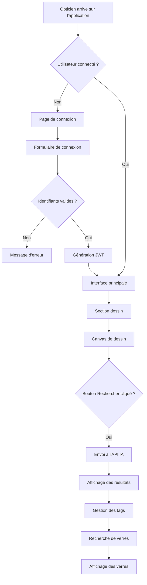

#  Analyse du Besoin d'Application avec Service d'Intelligence Artificielle

##  Vue d'ensemble

Ce document détaille la méthodologie complète pour analyser le besoin d'un commanditaire intégrant un service d'intelligence artificielle, en rédigeant les spécifications fonctionnelles et en modélisant les aspects clés, tout en respectant les standards d'utilisabilité et d'accessibilité. L'objectif est d'établir avec précision les objectifs de développement correspondant au besoin et à la faisabilité technique.

---

## 1. Comprendre et Analyser le Besoin du Commanditaire

L'analyse du besoin est la première étape cruciale. Elle vise à comprendre en profondeur les attentes, les problèmes à résoudre et les objectifs métier du commanditaire.

### 1.1. Collecte des Besoins

#### **Entretiens et Ateliers**
- **Sessions avec les parties prenantes** : Utilisateurs finaux, experts métier, direction
- **Recueil des attentes** : Problèmes actuels, améliorations souhaitées, contraintes
- **Analyse des processus existants** : Compréhension du workflow actuel

#### **Analyse Documentaire**
- **Étude des documents existants** : Processus métier, rapports, systèmes actuels
- **Compréhension du contexte** : Environnement de travail, contraintes réglementaires
- **Identification des opportunités** : Points d'amélioration possibles

#### **Observation Utilisateur**
- **Observation in situ** : Environnement de travail réel des utilisateurs
- **Identification des points de douleur** : Difficultés rencontrées quotidiennement
- **Opportunités d'amélioration** : Processus à optimiser

### 1.2. Identification des Objectifs

#### **Objectifs Métier**
- **Réduction des coûts** : Optimisation des processus, automatisation
- **Amélioration de la satisfaction client** : Service plus rapide et précis
- **Augmentation de l'efficacité** : Gain de temps, réduction des erreurs
- **Conformité réglementaire** : Respect des normes du secteur

#### **Objectifs Utilisateur**
- **Nouvelles capacités** : Fonctionnalités impossibles sans IA
- **Amélioration des tâches existantes** : Plus de rapidité, moins d'erreurs
- **Expérience utilisateur optimisée** : Interface intuitive et accessible

#### **Objectifs Techniques**
- **Performance** : Temps de réponse, précision des prédictions
- **Sécurité** : Protection des données, authentification
- **Intégration** : Compatibilité avec les systèmes existants
- **Évolutivité** : Capacité d'adaptation aux besoins futurs

---

## 2. Rédaction des Spécifications Fonctionnelles

Les spécifications fonctionnelles décrivent ce que le système doit faire. Elles servent de contrat entre le commanditaire et l'équipe de développement.

### 2.1. Structure des Spécifications Fonctionnelles

**Chaque spécification fonctionnelle couvre le contexte, les scénarios d'utilisation et les critères de validation.**

#### **Contexte**
- **Situation d'utilisation** : Quand et pourquoi la fonctionnalité est utilisée
- **Rôle dans le processus global** : Place dans le workflow métier
- **Acteurs impliqués** : Qui utilise cette fonctionnalité
- **Prérequis** : Conditions nécessaires pour utiliser la fonctionnalité

#### **Scénarios d'Utilisation (Use Cases)**
- **Acteurs** : Utilisateurs ou systèmes impliqués
- **Préconditions** : État du système avant l'utilisation
- **Déroulement normal** : Étapes principales de l'interaction
- **Déroulements alternatifs** : Cas d'erreur et exceptions
- **Postconditions** : État du système après l'utilisation

#### **Critères de Validation (Acceptance Criteria)**
- **Format Given/When/Then** : Étant donné/Quand/Alors
- **Conditions de succès** : Comment vérifier que la fonctionnalité fonctionne
- **Tests automatisables** : Critères mesurables et testables

### 2.2. Intégration de l'Intelligence Artificielle

#### **Données d'Entraînement**
- **Type de données** : Images, texte, données numériques
- **Volume requis** : Nombre d'exemples nécessaires
- **Qualité des données** : Nettoyage, validation, annotation
- **Sources de données** : Origine, licences, conformité RGPD

#### **Modèles d'IA**
- **Type de modèle** : Classification, régression, clustering
- **Algorithmes envisagés** : Deep Learning, Machine Learning classique
- **Performances attendues** : Précision, rappel, F1-score
- **Métriques de validation** : Critères d'évaluation du modèle

#### **Interactions avec l'IA**
- **Interface utilisateur** : Comment l'utilisateur interagit avec l'IA
- **Présentation des résultats** : Format des prédictions
- **Interprétation** : Explication des résultats pour l'utilisateur
- **Feedback utilisateur** : Amélioration continue du modèle

#### **Gestion des Erreurs et Incertitudes**
- **Prédictions de faible confiance** : Seuils de confiance
- **Erreurs du modèle** : Gestion des cas d'échec
- **Fallback** : Solutions de repli en cas d'échec
- **Monitoring** : Surveillance des performances du modèle

---

## 3. Modélisation du Besoin

La modélisation permet de représenter le besoin de manière structurée et visuelle, facilitant la compréhension et la communication.

### 3.1. Modélisation des Données

**La modélisation des données respecte un formalisme : Merise, entités-relations, etc.**

#### **Modèle Conceptuel de Données (MCD - Merise)**

Le MCD représente les entités (objets du monde réel) et les relations entre elles, indépendamment de toute contrainte technique. Il se concentre sur la sémantique des données.

**Composants du MCD :**
- **Entités** : Objets d'intérêt du domaine métier
  - Exemple : `Utilisateur`, `Verre`, `Gravure`, `Fournisseur`
- **Attributs** : Propriétés des entités
  - Exemple : `nom`, `email`, `indice`, `matériau`
- **Relations** : Liens entre les entités avec cardinalités
  - Exemple : Un `Utilisateur` peut `Dessiner` plusieurs `Gravures`

**Exemple MCD pour EngraveDetect :**
```
[UTILISATEUR] (1,N) --- DESSINE --- (0,N) [GRAVURE]
[GRAVURE] (0,N) --- CORRESPOND_A --- (1,1) [VERRE]
[VERRE] (0,N) --- APPARTIENT_A --- (1,1) [FOURNISSEUR]
[VERRE] (0,N) --- EST_COMPOSE_DE --- (1,1) [MATERIAU]
```

#### **Diagramme Entité-Relation (ERD - UML)**

Similaire au MCD, il représente les entités, leurs attributs et les relations, souvent utilisé dans le contexte de bases de données relationnelles.

**Caractéristiques :**
- **Orienté base de données** : Structure logique de la BD
- **Types de données** : Spécification des types
- **Contraintes** : Clés primaires, étrangères, unicité
- **Normalisation** : Élimination des redondances

#### **Modèle Logique de Données (MLD - Merise)**

Dérive du MCD et représente la structure des données sous forme de tables, colonnes et clés.

**Composants du MLD :**
- **Tables** : Représentation des entités
- **Colonnes** : Attributs avec types de données
- **Clés primaires** : Identifiants uniques
- **Clés étrangères** : Relations entre tables

**Exemple MLD pour EngraveDetect :**
```sql
-- Table principale
CREATE TABLE verres (
    id INTEGER PRIMARY KEY,
    nom VARCHAR(500) NOT NULL,
    materiaux VARCHAR(100),
    indice FLOAT,
    fournisseur VARCHAR(200),
    gravure TEXT,
    tags TEXT
);

-- Tables de référence
CREATE TABLE fournisseurs (
    id INTEGER PRIMARY KEY,
    nom VARCHAR(200) UNIQUE NOT NULL
);

CREATE TABLE materiaux (
    id INTEGER PRIMARY KEY,
    nom VARCHAR(200) UNIQUE NOT NULL
);
```

#### **Modèle Physique de Données (MPD - Merise)**

Décrit l'implémentation concrète de la base de données.

**Composants du MPD :**
- **Types spécifiques au SGBD** : VARCHAR, INTEGER, TIMESTAMP
- **Index** : Optimisation des performances
- **Contraintes techniques** : CHECK, NOT NULL, UNIQUE
- **Triggers** : Logique métier automatisée

**Exemple MPD pour EngraveDetect :**
```sql
-- Index pour les performances
CREATE INDEX idx_verres_fournisseur ON verres(fournisseur);
CREATE INDEX idx_verres_materiaux ON verres(materiaux);
CREATE INDEX idx_verres_indice ON verres(indice);

-- Contraintes de validation
ALTER TABLE verres ADD CONSTRAINT chk_indice 
    CHECK (indice >= 1.0 AND indice <= 2.0);

-- Triggers de maintenance
CREATE TRIGGER update_verres_timestamp 
    BEFORE UPDATE ON verres 
    FOR EACH ROW 
    SET updated_at = CURRENT_TIMESTAMP;
```

### 3.2. Modélisation des Parcours Utilisateurs

**La modélisation des parcours utilisateurs respecte un formalisme : schéma fonctionnel, wireframes, etc.**

#### **Schéma Fonctionnel (Flowchart)**

Représente l'enchaînement des étapes et des décisions qu'un utilisateur prend pour accomplir une tâche.

**Composants du schéma fonctionnel :**
- **Étapes** : Actions ou états du système/utilisateur
- **Décisions** : Points où l'utilisateur ou le système fait un choix
- **Connecteurs** : Liens entre les étapes et les décisions
- **Entrées/Sorties** : Données reçues et produites

**Exemple de schéma fonctionnel pour EngraveDetect :**


#### **Wireframes**

Représentations visuelles simplifiées de l'interface utilisateur.

**Types de wireframes :**
- **Low-fidelity** : Esquisses rapides, souvent dessinées à la main
- **Mid-fidelity** : Plus détaillés, créés avec des outils numériques
- **High-fidelity** : Très détaillés, proches du résultat final

**Composants des wireframes :**
- **Disposition des éléments** : Position des composants
- **Structure de l'information** : Hiérarchie et organisation
- **Flux de navigation** : Parcours utilisateur
- **Interactions** : Boutons, liens, formulaires

**Exemple de wireframe pour la page de connexion :**
```
┌─────────────────────────────────────┐
│           EngraveDetect            │
├─────────────────────────────────────┤
│                                     │
│    ┌─────────────────────────┐      │
│    │    Connexion            │      │
│    │                         │      │
│    │  Nom d'utilisateur:     │      │
│    │  [_________________]    │      │
│    │                         │      │
│    │  Mot de passe:          │      │
│    │  [_________________]    │      │
│    │                         │      │
│    │  [   Se connecter   ]  │      │
│    │                         │      │
│    │  Créer un compte       │      │
│    └─────────────────────────┘      │
│                                     │
└─────────────────────────────────────┘
```

#### **Maquettes (Mockups)**

Représentations plus fidèles de l'interface, incluant les couleurs, la typographie et les styles.

**Caractéristiques des maquettes :**
- **Design visuel** : Couleurs, polices, icônes
- **Interactions** : États hover, focus, active
- **Responsive design** : Adaptation aux différentes tailles d'écran
- **Accessibilité** : Contrastes, tailles de police

#### **Prototypes**

Versions interactives des maquettes permettant de simuler l'expérience utilisateur.

**Types de prototypes :**
- **Prototypes cliquables** : Navigation entre les écrans
- **Prototypes semi-fonctionnels** : Logique métier simulée
- **Prototypes complets** : Fonctionnalités réelles implémentées

---

## 4. Respect des Standards d'Utilisabilité et d'Accessibilité

L'utilisabilité et l'accessibilité sont fondamentales pour garantir que l'application est efficace, efficiente et satisfaisante pour tous les utilisateurs.

### 4.1. Utilisabilité (Usability)

L'utilisabilité se réfère à la facilité avec laquelle les utilisateurs peuvent apprendre à utiliser un système, l'utiliser efficacement et avec satisfaction.

#### **Principes de Nielsen**
1. **Visibilité du statut du système** : L'utilisateur doit toujours savoir où il se trouve
2. **Correspondance entre le système et le monde réel** : Utiliser un langage familier
3. **Contrôle et liberté de l'utilisateur** : Possibilité d'annuler et de corriger
4. **Cohérence et standards** : Respecter les conventions établies
5. **Prévention des erreurs** : Éviter les erreurs plutôt que de les corriger
6. **Reconnaissance plutôt que rappel** : Rendre les options visibles
7. **Flexibilité et efficience d'utilisation** : Raccourcis pour les utilisateurs experts
8. **Esthétique et design minimaliste** : Interface épurée et élégante
9. **Aide les utilisateurs à reconnaître, diagnostiquer et corriger les erreurs** : Messages d'erreur clairs
10. **Aide et documentation** : Documentation accessible et utile

#### **Tests Utilisateurs**
- **Tests de convivialité** : Observation des utilisateurs en situation réelle
- **Tests A/B** : Comparaison de différentes versions
- **Tests d'accessibilité** : Vérification avec des utilisateurs en situation de handicap
- **Tests de performance** : Mesure des temps de réponse et de l'efficacité

### 4.2. Accessibilité (Accessibility)

L'accessibilité vise à rendre les produits, services et environnements utilisables par le plus grand nombre de personnes possible.

**Les objectifs d'accessibilité sont directement intégrés aux critères d'acceptation des user stories.**

#### **Intégration dans les User Stories**
Chaque fonctionnalité développée doit être vérifiée non seulement pour son bon fonctionnement, mais aussi pour sa conformité aux exigences d'accessibilité.

**Exemple de critères d'acceptation accessibles :**
- **Navigation au clavier** : Toutes les fonctionnalités sont accessibles sans souris
- **Lecteurs d'écran** : Les éléments ont des étiquettes appropriées
- **Contraste** : Les couleurs respectent les ratios de contraste WCAG
- **Taille de police** : Texte lisible sans zoom (minimum 16px)
- **Alternatives textuelles** : Images avec attributs alt descriptifs

#### **Standards d'Accessibilité**

**Les objectifs d'accessibilité sont formulés en s'appuyant sur un des standards d'accessibilité : WCAG, RG2AA, etc.**

##### **WCAG (Web Content Accessibility Guidelines)**
Les directives internationales les plus reconnues pour l'accessibilité du contenu web.

**Principes WCAG 2.1 :**
1. **PERCEVABLE** : L'information et les composants de l'interface doivent être présentables aux utilisateurs de manière qu'ils puissent les percevoir
2. **UTILISABLE** : Les composants de l'interface et la navigation doivent être utilisables
3. **COMPRÉHENSIBLE** : L'information et l'utilisation de l'interface doivent être compréhensibles
4. **ROBUSTE** : Le contenu doit être suffisamment robuste pour être interprété de manière fiable par une large variété d'agents utilisateurs

**Niveaux de conformité :**
- **Niveau A** : Conformité minimale
- **Niveau AA** : Conformité recommandée (cible pour la plupart des sites)
- **Niveau AAA** : Conformité maximale

##### **RG2AA (Référentiel Général d'Amélioration de l'Accessibilité)**
Le référentiel français qui transpose les WCAG dans le contexte législatif français.

**Caractéristiques du RG2AA :**
- **Transposition française** : Adaptation au contexte national
- **Critères spécifiques** : Exigences particulières pour les administrations
- **Conformité légale** : Respect de la loi française sur l'accessibilité
- **Certification** : Processus de validation officiel

#### **Implémentation Technique de l'Accessibilité**

##### **HTML Sémantique**
```html
<!-- Structure sémantique correcte -->
<header>
    <h1>EngraveDetect</h1>
    <nav aria-label="Navigation principale">
        <ul>
            <li><a href="#dessin">Dessin</a></li>
            <li><a href="#resultats">Résultats</a></li>
        </ul>
    </nav>
</header>

<main>
    <section id="dessin" aria-labelledby="dessin-title">
        <h2 id="dessin-title">Dessiner une gravure</h2>
        <canvas 
            id="drawingCanvas" 
            aria-label="Zone de dessin pour la gravure"
            role="img"
            tabindex="0">
        </canvas>
    </section>
</main>
```

##### **CSS Accessible**
```css
/* Contrastes WCAG AA */
:root {
    --text-color: #202124; /* Contraste 16:1 sur blanc */
    --link-color: #1a5fb4; /* Contraste 7:1 sur blanc */
    --focus-color: #667eea; /* Contraste 4.5:1 sur blanc */
}

/* Focus visible */
*:focus {
    outline: 2px solid var(--focus-color);
    outline-offset: 2px;
}

/* Taille de police minimale */
body {
    font-size: 16px;
    line-height: 1.5;
}

/* Support du mode sombre */
@media (prefers-color-scheme: dark) {
    :root {
        --text-color: #ffffff;
        --background-color: #202124;
    }
}
```

##### **JavaScript Accessible**
```javascript
// Gestion du clavier
document.addEventListener('keydown', function(event) {
    if (event.key === 'Escape') {
        closeModal();
    }
    if (event.key === 'Enter' && event.target.tagName === 'BUTTON') {
        event.target.click();
    }
});

// Annonces aux lecteurs d'écran
function announceToScreenReader(message) {
    const announcement = document.createElement('div');
    announcement.setAttribute('aria-live', 'polite');
    announcement.setAttribute('aria-atomic', 'true');
    announcement.className = 'sr-only';
    announcement.textContent = message;
    document.body.appendChild(announcement);
    
    setTimeout(() => {
        document.body.removeChild(announcement);
    }, 1000);
}
```

---

## 5. Établissement des Objectifs de Développement et Faisabilité Technique

Une fois le besoin analysé, spécifié et modélisé, il est essentiel de définir des objectifs de développement clairs et de valider la faisabilité technique.

### 5.1. Définition des Objectifs SMART

Les objectifs de développement doivent être :

#### **Spécifiques**
- **Clairs et précis** : Pas d'ambiguïté sur ce qui doit être accompli
- **Contexte défini** : Conditions et contraintes spécifiques
- **Responsabilités assignées** : Qui fait quoi

**Exemple :** "L'application doit permettre aux opticiens d'identifier un verre en moins de 3 minutes avec une précision de 70% minimum"

#### **Mesurables**
- **Quantifiables** : Métriques pour suivre les progrès
- **Indicateurs de performance** : KPIs définis
- **Méthodes de mesure** : Comment évaluer le succès

**Exemple :** "Temps de réponse API < 2 secondes, précision du modèle IA > 70%, taux d'erreur < 5%"

#### **Atteignables**
- **Réalistes** : Compte tenu des ressources disponibles
- **Faisables** : Techniquement et économiquement viable
- **Motivants** : Défi stimulant mais pas impossible

**Exemple :** "Développement en 6 mois avec l'équipe actuelle et le budget alloué"

#### **Relevants**
- **En lien avec les objectifs métier** : Contribution aux buts de l'organisation
- **Prioritaires** : Alignement avec les stratégies
- **Valeur ajoutée** : Bénéfices clairs pour les utilisateurs

**Exemple :** "Réduction de 50% du temps d'identification des verres, amélioration de la satisfaction client"

#### **Temporellement définis**
- **Échéances claires** : Dates de début et de fin
- **Jalons intermédiaires** : Points de contrôle
- **Planning détaillé** : Séquence des activités

**Exemple :** "Livraison MVP en 3 mois, version complète en 6 mois, déploiement production en 8 mois"

### 5.2. Analyse de Faisabilité Technique

#### **Technologies**
- **Frameworks** : Choix des technologies adaptées au besoin
- **Bases de données** : Sélection selon les contraintes de performance
- **Services IA** : Évaluation des solutions disponibles
- **Intégrations** : Compatibilité avec les systèmes existants

**Exemple d'analyse technologique :**
```
Technologie    | Avantages           | Inconvénients      | Recommandation
---------------|---------------------|-------------------|----------------
FastAPI        | Performance, docs  | Communauté jeune  |  Adopté
PostgreSQL     | Robustesse, ACID   | Complexité        |  Adopté
PyTorch        | Flexibilité IA     | Courbe d'apprentissage |  Adopté
React          | Écosystème riche   | Complexité        |  Trop lourd
Vue.js         | Simplicité         | Communauté        |  Alternative
```

#### **Infrastructure**
- **Capacité de traitement** : Support de la charge attendue
- **Scalabilité** : Adaptation aux besoins futurs
- **Sécurité** : Protection des données et des accès
- **Disponibilité** : Temps de service requis

**Exemple d'analyse infrastructure :**
```
Composant      | Besoin actuel      | Besoin futur       | Solution
---------------|---------------------|-------------------|----------------
CPU            | 4 cores            | 8 cores           | Scalable
RAM            | 8 GB               | 16 GB             | Scalable
Stockage       | 100 GB             | 500 GB            | Scalable
Réseau         | 100 Mbps           | 1 Gbps            | Scalable
```

#### **Intégrations**
- **Systèmes tiers** : Connexion avec les outils existants
- **APIs externes** : Services d'IA, bases de données
- **Sécurité** : Authentification, autorisation, chiffrement
- **Standards** : Respect des protocoles établis

#### **Expertise**
- **Compétences requises** : IA, développement web, DevOps
- **Formation nécessaire** : Montée en compétence de l'équipe
- **Recrutement** : Besoins en ressources humaines
- **Partners** : Collaboration avec des experts externes

#### **Risques Techniques**

**Identification des risques :**
1. **Performance de l'IA** : Modèle pas assez précis
2. **Complexité d'intégration** : Difficultés techniques
3. **Sécurité** : Vulnérabilités potentielles
4. **Scalabilité** : Limitations de croissance

**Stratégies d'atténuation :**
1. **Prototypage rapide** : Validation technique précoce
2. **Tests intensifs** : Validation de la sécurité
3. **Architecture modulaire** : Facilité d'évolution
4. **Monitoring continu** : Détection des problèmes

---

## 6. Exemple Concret : EngraveDetect

### 6.1. Analyse du Besoin

#### **Contexte du Commanditaire**
- **Secteur** : Optique professionnelle
- **Problème** : Identification manuelle fastidieuse des verres
- **Objectif** : Automatisation via IA pour gagner du temps

#### **Spécifications Fonctionnelles**
- **Contexte** : Magasin d'optique, identification rapide
- **Scénarios** : Dessin → IA → Résultats → Sélection
- **Critères** : Précision > 70%, temps < 3 minutes

### 6.2. Modélisation des Données

#### **MCD (Merise)**
```
[UTILISATEUR] (1,N) --- DESSINE --- (0,N) [GRAVURE]
[GRAVURE] (0,N) --- CORRESPOND_A --- (1,1) [VERRE]
[VERRE] (0,N) --- APPARTIENT_A --- (1,1) [FOURNISSEUR]
```

#### **MLD (SQL)**
```sql
CREATE TABLE verres (
    id SERIAL PRIMARY KEY,
    nom VARCHAR(500) NOT NULL,
    materiaux VARCHAR(100),
    indice FLOAT,
    fournisseur VARCHAR(200),
    gravure TEXT,
    tags TEXT
);
```

### 6.3. Modélisation des Parcours

#### **Schéma Fonctionnel**
- **Connexion** → **Dessin** → **IA** → **Résultats** → **Sélection**
- **Points de décision** : Validation, erreurs, alternatives
- **Gestion d'erreurs** : Fallback, retry, messages

#### **Wireframes**
- **Interface épurée** : Focus sur l'essentiel
- **Navigation claire** : Parcours utilisateur logique
- **Feedback immédiat** : États de chargement, résultats

### 6.4. Accessibilité

#### **Conformité WCAG 2.1 AA**
- **Contrastes** : Ratios respectés (4.5:1 minimum)
- **Navigation** : Clavier et lecteurs d'écran
- **Structure** : HTML sémantique
- **Alternatives** : Textes descriptifs

#### **Critères d'Acceptation Accessibles**
-  Formulaire navigable au clavier
-  Canvas avec instructions vocales
-  Messages d'erreur clairs
-  Contraste suffisant

### 6.5. Objectifs SMART

#### **Spécifiques**
- "Permettre l'identification de verres en 3 minutes maximum"

#### **Mesurables**
- "Précision du modèle IA > 70%"
- "Temps de réponse API < 2 secondes"

#### **Atteignables**
- "Développement en 6 mois avec l'équipe actuelle"

#### **Relevants**
- "Réduction de 50% du temps d'identification"

#### **Temporellement définis**
- "Livraison MVP en 3 mois, version complète en 6 mois"

---

Cette approche structurée permet de transformer un besoin initial en un plan de développement clair, robuste et aligné avec les meilleures pratiques en matière d'ingénierie logicielle, d'utilisabilité et d'accessibilité. 