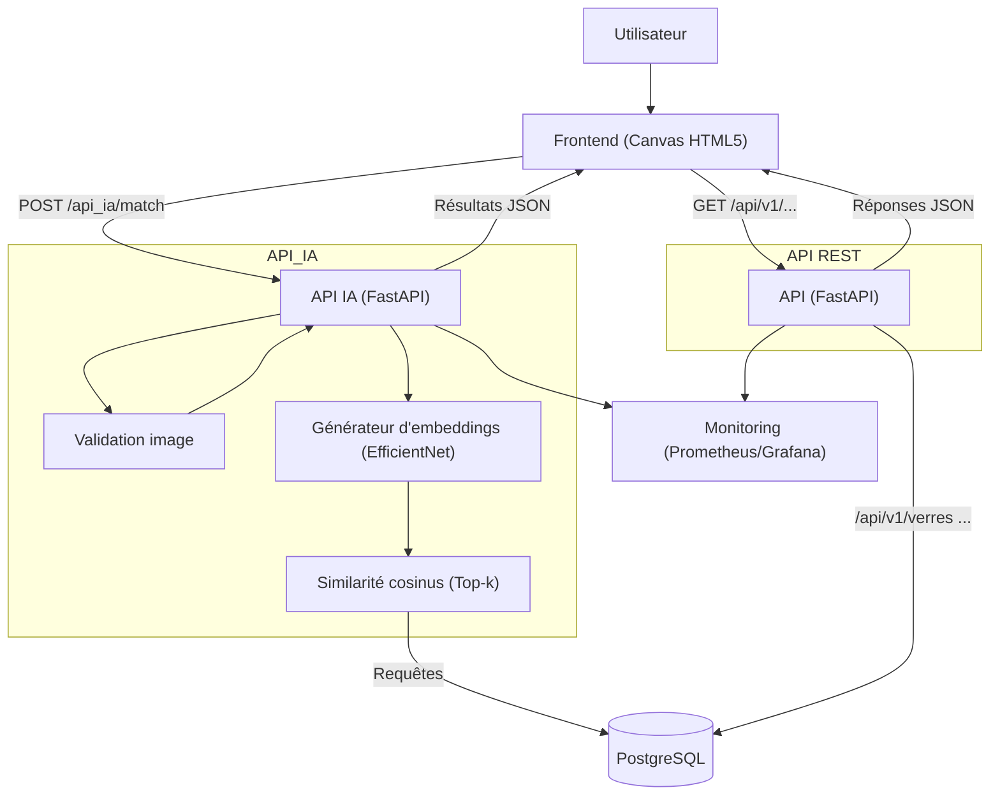
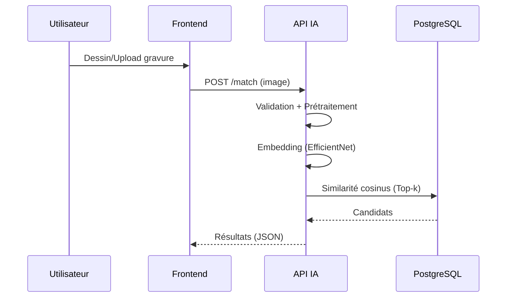
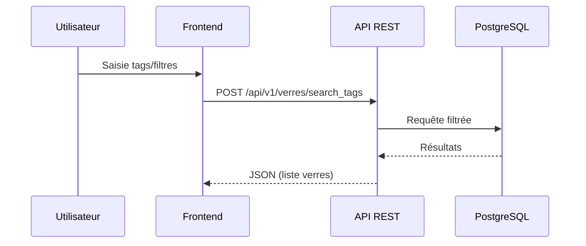
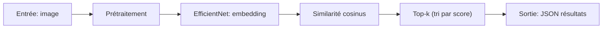

## Présentation visuelle (Canva) – Schémas et repères

Ce document regroupe des schémas Mermaid et des repères prêts à intégrer dans une présentation Canva. Il reflète le fonctionnement réel du projet (API IA, pipeline de données, bases, monitoring) sans détails inventés.

---

### 1) Schéma d’architecture (C9)



Points clés:
- API IA encapsule la validation d’images, l’extraction d’embeddings (EfficientNet) et la recherche de similarité.
- API REST interroge la base pour la partie métier (verres, filtres, tags).
- Monitoring instrumente les temps de réponse, erreurs, ressources.

---

### 2) Flux / Pipelines (C10)

#### 2.1 Image → Match (flux principal)


#### 2.2 Recherche par tags (alternative)


---

### 3) Captures d’écran ciblées (à insérer dans Canva)

- Swagger `/docs` (API ou API IA)
  - Encadrer 1 endpoint clé: `/match` (IA) ou `/api/v1/verres` (REST)
  - Légender: méthode HTTP, schéma d’entrée/sortie

- Dashboard Grafana
  - Encadrer: latence P95/P99, taux d’erreurs (5xx), CPU/RAM
  - Légende: plage temporelle, panneaux essentiels

- Interface Front
  - Canvas (zone de dessin / upload)
  - Zone des tags/filtres
  - Bloc résultats (top-k)

Astuce: placer des boîtes et flèches annotées pour guider le regard (cause → effet).

---

### 4) Encadrés “logique métier”

Exemple pour `/match` (côté API IA):



À rappeler: contrôle d’intégrité (format image), fallback messages d’erreur clairs.

---

### 5) Indicateurs chiffrés (exemples à mettre en slide)

| Indicateur | Définition | Source | Seuils/Attendus |
|---|---|---|---|
| Latence P95 `/match` | 95e percentile du temps de réponse | Prometheus/Grafana | P95 < 500 ms |
| Erreurs 5xx | Taux d’erreurs serveur | Prometheus/Grafana | < 1% |
| Disponibilité | Uptime API | Grafana | > 99% |
| Couverture tests | % lignes couvertes | Pytest coverage | > 80% |

Exemples de requêtes (PromQL):

```promql
histogram_quantile(0.95, sum(rate(http_request_duration_seconds_bucket{route="/match"}[5m])) by (le))
```

```promql
sum(rate(http_requests_total{status=~"5.."}[5m])) / sum(rate(http_requests_total[5m]))
```

Notes:
- Placer ces métriques sur un dashboard concis (latence, erreurs, ressource CPU/RAM).
- Ajouter des annotations déploiements pour contextualiser les variations.

---

### Réutilisation dans Canva

- Copier-coller les blocs Mermaid pour générer les schémas. 
- Ajouter vos captures d’écrans (Swagger, Grafana, Front) en encadrant les éléments clés.
- Garder 1 slide par idée (Architecture, Flux Match, Flux Tags, Métriques).

