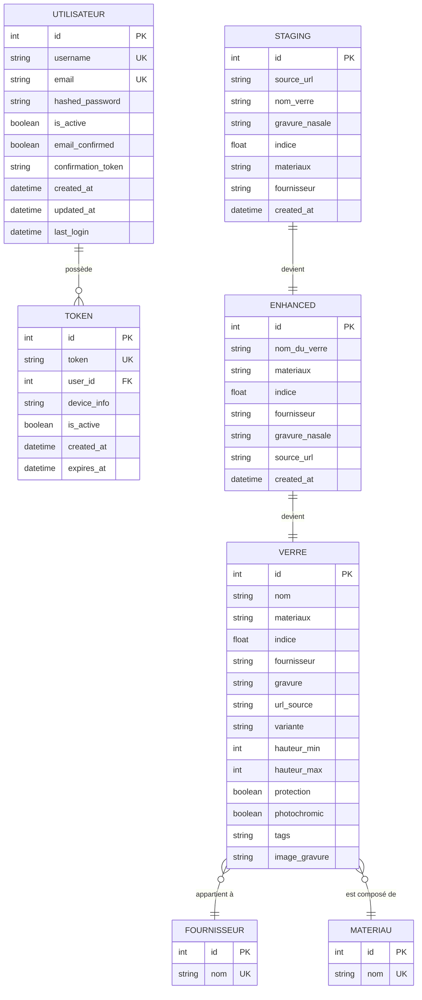

# 🗄️ Schéma Entité-Relation Complet - EngraveDetect

## 📋 Vue d'ensemble

Ce document présente le schéma entité-relation complet de la base de données EngraveDetect, basé sur l'analyse du code source et des modèles SQLAlchemy existants.

---

## 🎯 Méthodologie Merise

Le schéma suit la méthodologie Merise avec :
- **MCD** (Modèle Conceptuel de Données)
- **MLD** (Modèle Logique de Données) 
- **MPD** (Modèle Physique de Données)

---

## 🔍 Modèle Conceptuel de Données (MCD)

### **Entités Principales**

#### **1. VERRE (Entité Centrale)**
**Identifiant :** `id` (PK)

**Propriétés :**
- `nom` (String) : Nom complet du verre
- `materiaux` (String) : Matériau du verre
- `indice` (Float) : Indice de réfraction
- `fournisseur` (String) : Nom du fournisseur
- `gravure` (String) : Code de gravure nasale
- `url_source` (String) : URL source des données
- `variante` (String) : Variante extraite du nom
- `hauteur_min` (Integer) : Hauteur minimale
- `hauteur_max` (Integer) : Hauteur maximale
- `protection` (Boolean) : Présence de protection
- `photochromic` (Boolean) : Verre photochromique
- `tags` (String) : Tags extraits du nom
- `image_gravure` (String) : Chemin vers l'image

#### **2. UTILISATEUR (Entité RGPD)**
**Identifiant :** `id` (PK)

**Propriétés :**
- `username` (String) : Nom d'utilisateur unique
- `email` (String) : Email unique
- `hashed_password` (String) : Mot de passe hashé
- `is_active` (Boolean) : Statut du compte
- `email_confirmed` (Boolean) : Email confirmé
- `confirmation_token` (String) : Token de confirmation
- `created_at` (DateTime) : Date de création
- `updated_at` (DateTime) : Date de mise à jour
- `last_login` (DateTime) : Dernière connexion

#### **3. TOKEN (Entité de Sécurité)**
**Identifiant :** `id` (PK)

**Propriétés :**
- `token` (String) : Token JWT unique
- `user_id` (Integer) : Référence vers utilisateur
- `device_info` (String) : Informations sur l'appareil
- `is_active` (Boolean) : Statut du token
- `created_at` (DateTime) : Date de création
- `expires_at` (DateTime) : Date d'expiration

#### **4. FOURNISSEUR (Entité de Référence)**
**Identifiant :** `id` (PK)

**Propriétés :**
- `nom` (String) : Nom du fournisseur

#### **5. MATERIAU (Entité de Référence)**
**Identifiant :** `id` (PK)

**Propriétés :**
- `nom` (String) : Nom du matériau

### **Entités de Traitement (Pipeline de Données)**

#### **6. STAGING (Zone de Transit)**
**Identifiant :** `id` (PK)

**Propriétés :**
- `source_url` (String) : URL source
- `nom_verre` (String) : Nom du verre brut
- `gravure_nasale` (String) : Gravure nasale brute
- `indice` (Float) : Indice de réfraction
- `materiaux` (String) : Matériau brut
- `fournisseur` (String) : Fournisseur brut
- `created_at` (DateTime) : Date de création

#### **7. ENHANCED (Zone de Traitement)**
**Identifiant :** `id` (PK)

**Propriétés :**
- `nom_du_verre` (String) : Nom nettoyé
- `materiaux` (String) : Matériau nettoyé
- `indice` (Float) : Indice validé
- `fournisseur` (String) : Fournisseur normalisé
- `gravure_nasale` (String) : Gravure nettoyée
- `source_url` (String) : URL source
- `created_at` (DateTime) : Date de création

---

## 🔗 Relations Conceptuelles



---

## 📊 Modèle Logique de Données (MLD)

### **Tables Principales**

#### **1. Table `verres`**
```sql
CREATE TABLE verres (
    id SERIAL PRIMARY KEY,
    nom VARCHAR(500) NOT NULL,
    materiaux VARCHAR(100),
    indice FLOAT,
    fournisseur VARCHAR(200),
    gravure VARCHAR(1000),
    url_source VARCHAR(500),
    variante VARCHAR(200),
    hauteur_min INTEGER,
    hauteur_max INTEGER,
    protection BOOLEAN DEFAULT FALSE,
    photochromic BOOLEAN DEFAULT FALSE,
    tags VARCHAR(500),
    image_gravure VARCHAR(500)
);
```

#### **2. Table `users`**
```sql
CREATE TABLE users (
    id SERIAL PRIMARY KEY,
    username VARCHAR(50) UNIQUE NOT NULL,
    email VARCHAR(255) UNIQUE NOT NULL,
    hashed_password VARCHAR(255) NOT NULL,
    is_active BOOLEAN DEFAULT TRUE,
    email_confirmed BOOLEAN DEFAULT FALSE,
    confirmation_token VARCHAR(255) UNIQUE,
    created_at TIMESTAMP DEFAULT CURRENT_TIMESTAMP,
    updated_at TIMESTAMP DEFAULT CURRENT_TIMESTAMP,
    last_login TIMESTAMP
);
```

#### **3. Table `tokens`**
```sql
CREATE TABLE tokens (
    id SERIAL PRIMARY KEY,
    token VARCHAR(500) UNIQUE NOT NULL,
    user_id INTEGER NOT NULL,
    device_info VARCHAR(200),
    is_active BOOLEAN DEFAULT TRUE,
    created_at TIMESTAMP DEFAULT CURRENT_TIMESTAMP,
    expires_at TIMESTAMP NOT NULL,
    FOREIGN KEY (user_id) REFERENCES users(id) ON DELETE CASCADE
);
```

#### **4. Table `fournisseurs`**
```sql
CREATE TABLE fournisseurs (
    id SERIAL PRIMARY KEY,
    nom VARCHAR(200) UNIQUE NOT NULL
);
```

#### **5. Table `materiaux`**
```sql
CREATE TABLE materiaux (
    id SERIAL PRIMARY KEY,
    nom VARCHAR(200) UNIQUE NOT NULL
);
```

### **Tables de Traitement**

#### **6. Table `staging`**
```sql
CREATE TABLE staging (
    id SERIAL PRIMARY KEY,
    source_url TEXT,
    nom_verre TEXT,
    gravure_nasale TEXT,
    indice DOUBLE PRECISION,
    materiaux VARCHAR(100),
    fournisseur VARCHAR(100),
    created_at TIMESTAMP DEFAULT CURRENT_TIMESTAMP
);
```

#### **7. Table `enhanced`**
```sql
CREATE TABLE enhanced (
    id SERIAL PRIMARY KEY,
    nom_du_verre TEXT,
    materiaux VARCHAR(100),
    indice DOUBLE PRECISION,
    fournisseur VARCHAR(100),
    gravure_nasale TEXT,
    source_url TEXT,
    created_at TIMESTAMP DEFAULT CURRENT_TIMESTAMP
);
```

---

## ⚙️ Modèle Physique de Données (MPD)

### **Index de Performance**

#### **Index sur la table `verres`**
```sql
CREATE INDEX idx_verres_nom ON verres(nom);
CREATE INDEX idx_verres_fournisseur ON verres(fournisseur);
CREATE INDEX idx_verres_materiaux ON verres(materiaux);
CREATE INDEX idx_verres_indice ON verres(indice);
CREATE INDEX idx_verres_protection ON verres(protection);
CREATE INDEX idx_verres_photochromic ON verres(photochromic);
```

#### **Index sur la table `users`**
```sql
CREATE INDEX idx_users_username ON users(username);
CREATE INDEX idx_users_email ON users(email);
CREATE INDEX idx_users_is_active ON users(is_active);
```

#### **Index sur la table `tokens`**
```sql
CREATE INDEX idx_tokens_token ON tokens(token);
CREATE INDEX idx_tokens_user_id ON tokens(user_id);
CREATE INDEX idx_tokens_expires_at ON tokens(expires_at);
```

#### **Index sur les tables de traitement**
```sql
CREATE INDEX idx_staging_fournisseur ON staging(fournisseur);
CREATE INDEX idx_staging_materiaux ON staging(materiaux);
CREATE INDEX idx_enhanced_fournisseur ON enhanced(fournisseur);
CREATE INDEX idx_enhanced_materiaux ON enhanced(materiaux);
```

### **Contraintes d'Intégrité**

#### **Contraintes de Validation**
```sql
-- Contraintes sur verres
ALTER TABLE verres ADD CONSTRAINT chk_indice 
    CHECK (indice >= 1.0 AND indice <= 2.0);

ALTER TABLE verres ADD CONSTRAINT chk_hauteur 
    CHECK (hauteur_min <= hauteur_max);

ALTER TABLE verres ADD CONSTRAINT chk_hauteur_min 
    CHECK (hauteur_min >= 0);

ALTER TABLE verres ADD CONSTRAINT chk_hauteur_max 
    CHECK (hauteur_max <= 100);

-- Contraintes sur users
ALTER TABLE users ADD CONSTRAINT chk_email 
    CHECK (email LIKE '%@%');

-- Contraintes sur tokens
ALTER TABLE tokens ADD CONSTRAINT chk_expires_at 
    CHECK (expires_at > created_at);
```

#### **Contraintes de Référence**
```sql
-- Clé étrangère tokens -> users
ALTER TABLE tokens ADD CONSTRAINT fk_tokens_user_id 
    FOREIGN KEY (user_id) REFERENCES users(id) ON DELETE CASCADE;
```

### **Triggers de Maintenance**

#### **Trigger de mise à jour automatique**
```sql
CREATE OR REPLACE FUNCTION update_updated_at_column()
RETURNS TRIGGER AS $$
BEGIN
    NEW.updated_at = CURRENT_TIMESTAMP;
    RETURN NEW;
END;
$$ language 'plpgsql';

CREATE TRIGGER update_users_updated_at 
    BEFORE UPDATE ON users 
    FOR EACH ROW EXECUTE FUNCTION update_updated_at_column();
```

#### **Trigger de nettoyage des tokens expirés**
```sql
CREATE OR REPLACE FUNCTION cleanup_expired_tokens()
RETURNS TRIGGER AS $$
BEGIN
    DELETE FROM tokens WHERE expires_at < CURRENT_TIMESTAMP;
    RETURN NULL;
END;
$$ language 'plpgsql';

CREATE TRIGGER trigger_cleanup_tokens 
    AFTER INSERT ON tokens 
    FOR EACH ROW EXECUTE FUNCTION cleanup_expired_tokens();
```

---

## 🔒 Aspects Sécurité et RGPD

### **Chiffrement des Données Sensibles**
- **Mots de passe** : Hashés avec bcrypt
- **Tokens** : Chiffrés avec JWT
- **Emails** : Stockés en clair (nécessaire pour les notifications)

### **Audit et Traçabilité**
```sql
-- Table d'audit des événements de sécurité
CREATE TABLE security_events (
    id SERIAL PRIMARY KEY,
    timestamp TIMESTAMP DEFAULT CURRENT_TIMESTAMP,
    event_type VARCHAR(50) NOT NULL,
    message TEXT,
    username VARCHAR(100),
    ip_address VARCHAR(45)
);
```

### **Conformité RGPD**
- **Minimisation** : Seules les données nécessaires sont collectées
- **Finalité** : Données utilisées uniquement pour l'identification de verres
- **Conservation** : Politique de rétention définie
- **Droit à l'oubli** : Suppression possible des comptes utilisateurs

---

## 📈 Optimisations de Performance

### **Partitionnement**
```sql
-- Partitionnement par fournisseur (si volumétrie importante)
CREATE TABLE verres_partitioned (
    LIKE verres INCLUDING ALL
) PARTITION BY LIST (fournisseur);
```

### **Archivage**
```sql
-- Table d'archivage pour les anciennes données
CREATE TABLE verres_archive (
    LIKE verres INCLUDING ALL,
    archived_at TIMESTAMP DEFAULT CURRENT_TIMESTAMP
);
```

### **Cache et Vues Matérialisées**
```sql
-- Vue matérialisée pour les statistiques fréquentes
CREATE MATERIALIZED VIEW verres_stats AS
SELECT 
    fournisseur,
    COUNT(*) as nb_verres,
    AVG(indice) as indice_moyen,
    COUNT(CASE WHEN protection THEN 1 END) as nb_protection
FROM verres 
GROUP BY fournisseur;

-- Rafraîchissement automatique
REFRESH MATERIALIZED VIEW verres_stats;
```

---

## 🔄 Flux de Données

### **Pipeline de Traitement**
1. **Extraction** → Table `staging`
2. **Nettoyage** → Table `enhanced`
3. **Enrichissement** → Table `verres`
4. **API** → Accès aux données finales

### **Gestion des Références**
1. **Création automatique** des fournisseurs et matériaux
2. **Normalisation** des noms
3. **Liaison** via clés étrangères
4. **Maintenance** des références

---

Ce schéma entité-relation complet respecte les principes de la méthodologie Merise et reflète fidèlement l'architecture de données existante d'EngraveDetect, avec une attention particulière portée à la sécurité, aux performances et à la conformité RGPD. 