#  Schéma Fonctionnel - Parcours Opticien EngraveDetect

##  Vue d'ensemble

Ce schéma fonctionnel détaille l'enchaînement complet des étapes côté opticien, de la connexion initiale à l'exploration des résultats, en passant par la saisie d'un dessin ou de tags.

---

##  Acteurs et Contexte

**Acteur principal :** Opticien professionnel  
**Objectif :** Identifier un verre optique à partir de sa gravure nasale  
**Contexte d'usage :** Magasin d'optique, identification rapide pour conseil client

---

##  Schéma Fonctionnel Détaillé

```mermaid
flowchart TD
    %% === DÉBUT ===
    START([Opticien arrive sur l'application]) --> AUTH{Utilisateur connecté ?}
    
    %% === AUTHENTIFICATION ===
    AUTH -->|Non| LOGIN[Page de connexion]
    LOGIN --> LOGIN_FORM[Formulaire de connexion]
    LOGIN_FORM --> LOGIN_VALID{Identifiants valides ?}
    LOGIN_VALID -->|Non| LOGIN_ERROR[Message d'erreur]
    LOGIN_ERROR --> LOGIN_FORM
    
    LOGIN_VALID -->|Oui| TOKEN[Génération JWT]
    TOKEN --> STORAGE[Stockage token localStorage]
    STORAGE --> MAIN_INTERFACE[Interface principale]
    
    AUTH -->|Oui| MAIN_INTERFACE
    
    %% === INTERFACE PRINCIPALE ===
    MAIN_INTERFACE --> HEADER[Barre de navigation]
    HEADER --> USER_INFO[Affichage utilisateur connecté]
    USER_INFO --> DASHBOARD_BTN{Bouton Dashboard cliqué ?}
    DASHBOARD_BTN -->|Oui| GRAFANA[Ouverture Grafana dans nouvel onglet]
    GRAFANA --> MAIN_INTERFACE
    
    DASHBOARD_BTN -->|Non| LOGOUT_BTN{Bouton Déconnexion cliqué ?}
    LOGOUT_BTN -->|Oui| LOGOUT[Suppression token + retour connexion]
    LOGOUT --> START
    
    LOGOUT_BTN -->|Non| DRAWING_SECTION[Section dessin]
    
    %% === SECTION DESSIN ===
    DRAWING_SECTION --> CANVAS[Canvas de dessin 400x400px]
    CANVAS --> DRAWING_ACTIONS{Action sur le canvas ?}
    
    DRAWING_ACTIONS -->|Dessin| DRAW[Affichage en temps réel]
    DRAW --> CANVAS
    
    DRAWING_ACTIONS -->|Touche Espace| CLEAR_KEY[Effacement complet]
    CLEAR_KEY --> CANVAS
    
    DRAWING_ACTIONS -->|Bouton Effacer| CLEAR_BTN[Effacement complet]
    CLEAR_BTN --> CANVAS
    
    DRAWING_ACTIONS -->|Bouton Rechercher| SEARCH_IA{Canvas vide ?}
    SEARCH_IA -->|Oui| EMPTY_ERROR[Message : Veuillez dessiner d'abord]
    EMPTY_ERROR --> CANVAS
    
    SEARCH_IA -->|Non| IA_PROCESS[Envoi image à API /match]
    IA_PROCESS --> LOADING[Indicateur de chargement]
    LOADING --> IA_RESPONSE{API répond ?}
    
    IA_RESPONSE -->|Erreur| IA_ERROR[Message d'erreur]
    IA_ERROR --> CANVAS
    
    IA_RESPONSE -->|Succès| IA_RESULTS[Affichage 20 résultats]
    IA_RESULTS --> RESULTS_GRID[Grille de résultats]
    
    %% === GESTION DES RÉSULTATS IA ===
    RESULTS_GRID --> RESULT_CLICK{Utilisateur clique sur un résultat ?}
    RESULT_CLICK -->|Oui| ADD_TAG[Ajout du tag à la liste]
    ADD_TAG --> TAG_LIST[Section Tags sélectionnés]
    RESULT_CLICK -->|Non| MORE_RESULTS{Plus de résultats à afficher ?}
    MORE_RESULTS -->|Oui| RESULTS_GRID
    MORE_RESULTS -->|Non| TAG_SECTION[Section tags]
    
    %% === SECTION TAGS ===
    TAG_SECTION --> TAG_LIST
    TAG_LIST --> TAG_ACTIONS{Action sur les tags ?}
    
    TAG_ACTIONS -->|Bouton × sur tag| REMOVE_TAG[Suppression du tag]
    REMOVE_TAG --> TAG_LIST
    
    TAG_ACTIONS -->|Bouton Réinitialiser| RESET_TAGS[Vidage de la liste]
    RESET_TAGS --> TAG_LIST
    
    TAG_ACTIONS -->|Aucune| MANUAL_SECTION[Section saisie manuelle]
    
    %% === SAISIE MANUELLE ===
    MANUAL_SECTION --> MANUAL_INPUT[Champ de saisie texte]
    MANUAL_INPUT --> MANUAL_BTN{Bouton Ajouter ces tags cliqué ?}
    MANUAL_BTN -->|Oui| MANUAL_PROCESS[Traitement des tags]
    MANUAL_PROCESS --> MANUAL_VALID{Format valide ?}
    MANUAL_VALID -->|Non| MANUAL_ERROR[Message d'erreur]
    MANUAL_ERROR --> MANUAL_INPUT
    
    MANUAL_VALID -->|Oui| MANUAL_ADD[Ajout des tags à la liste]
    MANUAL_ADD --> TAG_LIST
    
    MANUAL_BTN -->|Non| SEARCH_SECTION[Section recherche]
    
    %% === RECHERCHE DE VERRES ===
    SEARCH_SECTION --> SEARCH_BTN{Bouton Rechercher les verres cliqué ?}
    SEARCH_BTN -->|Non| MAIN_INTERFACE
    
    SEARCH_BTN -->|Oui| TAGS_CHECK{Liste de tags vide ?}
    TAGS_CHECK -->|Oui| TAGS_ERROR[Message Ajoutez des tags d'abord]
    TAGS_ERROR --> TAG_SECTION
    
    TAGS_CHECK -->|Non| VERRE_SEARCH[Envoi tags à API /search_tags]
    VERRE_SEARCH --> VERRE_LOADING[Indicateur de chargement]
    VERRE_LOADING --> VERRE_RESPONSE{API répond ?}
    
    VERRE_RESPONSE -->|Erreur| VERRE_ERROR[Message d'erreur]
    VERRE_ERROR --> SEARCH_SECTION
    
    VERRE_RESPONSE -->|Succès| VERRE_RESULTS[Affichage des verres]
    VERRE_RESULTS --> VERRE_LIST[Liste des verres trouvés]
    
    %% === EXPLORATION DES RÉSULTATS ===
    VERRE_LIST --> VERRE_COUNT[Affichage nombre de verres]
    VERRE_COUNT --> VERRE_CARDS[Cartes des verres]
    VERRE_CARDS --> VERRE_CLICK{Utilisateur clique sur un verre ?}
    
    VERRE_CLICK -->|Oui| VERRE_DETAILS[Ouverture modale détails]
    VERRE_DETAILS --> DETAILS_MODAL[Modale avec informations complètes]
    
    DETAILS_MODAL --> DETAILS_CONTENT[Contenu de la modale]
    DETAILS_CONTENT --> DETAILS_SECTIONS[Affichage par sections]
    DETAILS_SECTIONS --> DETAILS_ACTIONS{Action dans la modale ?}
    
    DETAILS_ACTIONS -->|Bouton Actualiser| REFRESH_DATA[Rechargement données]
    REFRESH_DATA --> DETAILS_CONTENT
    
    DETAILS_ACTIONS -->|Bouton × ou clic extérieur| CLOSE_MODAL[Fermeture modale]
    CLOSE_MODAL --> VERRE_LIST
    
    VERRE_CLICK -->|Non| VERRE_PAGINATION{Plus de verres à afficher ?}
    VERRE_PAGINATION -->|Oui| VERRE_LIST
    VERRE_PAGINATION -->|Non| NEW_SEARCH{Recommencer une recherche ?}
    
    %% === NOUVELLE RECHERCHE ===
    NEW_SEARCH -->|Oui| RESET_ALL[Réinitialisation complète]
    RESET_ALL --> CANVAS
    
    NEW_SEARCH -->|Non| END([Fin de session])
    
    %% === STYLES SIMPLIFIÉS ===
    %% Pas de couleurs pour une meilleure lisibilité
```

---

##  Détail des Étapes Fonctionnelles

### **1. PHASE D'AUTHENTIFICATION**

#### **1.1 Arrivée sur l'application**
- **Action :** L'opticien accède à l'URL de l'application
- **Vérification :** Le système vérifie si un token JWT valide existe
- **Décision :** 
  - Si token valide → Interface principale
  - Si pas de token → Page de connexion

#### **1.2 Connexion utilisateur**
- **Saisie :** Nom d'utilisateur et mot de passe
- **Validation :** Vérification des identifiants via API `/api/v1/auth/token`
- **Résultat :**
  -  Succès → Génération JWT, stockage localStorage, redirection interface principale
  -  Échec → Message d'erreur, retour au formulaire

### **2. PHASE D'INTERFACE PRINCIPALE**

#### **2.1 Barre de navigation**
- **Affichage :** Logo, nom utilisateur, boutons Dashboard et Déconnexion
- **Actions possibles :**
  - **Dashboard :** Ouverture Grafana dans nouvel onglet
  - **Déconnexion :** Suppression token, retour page connexion

#### **2.2 Section dessin**
- **Canvas :** Zone de dessin 400x400px, responsive
- **Actions disponibles :**
  - **Dessin :** Souris/tactile, affichage temps réel
  - **Effacement :** Bouton "" ou touche Espace
  - **Recherche IA :** Bouton " Rechercher les symboles similaires"

### **3. PHASE DE RECHERCHE IA**

#### **3.1 Validation du dessin**
- **Vérification :** Canvas non vide
- **Décision :**
  -  Vide → Message "Veuillez dessiner d'abord"
  -  Dessiné → Envoi à l'API

#### **3.2 Traitement IA**
- **Envoi :** Image canvas à API `/api_ia/match`
- **Traitement :** Modèle EfficientNet, calcul embeddings, recherche similarité
- **Résultat :** 20 meilleures correspondances avec scores

#### **3.3 Affichage des résultats**
- **Format :** Grille responsive (4 colonnes desktop, 2 tablet, 1 mobile)
- **Contenu :** Image symbole, nom, score de similarité, bouton " Ajouter ce tag"

### **4. PHASE DE GESTION DES TAGS**

#### **4.1 Sélection depuis résultats IA**
- **Action :** Clic sur " Ajouter ce tag"
- **Traitement :** Ajout à la liste des tags sélectionnés
- **Contrôle :** Éviter les doublons

#### **4.2 Saisie manuelle**
- **Champ :** Input texte pour tags manuels
- **Format :** Séparation par espaces ou virgules
- **Validation :** Ignorer tags vides ou dupliqués

#### **4.3 Gestion de la liste**
- **Affichage :** Tags avec bouton "×" pour suppression
- **Actions :**
  - **Suppression individuelle :** Bouton "×" sur chaque tag
  - **Réinitialisation globale :** Bouton " Réinitialiser les tags"

### **5. PHASE DE RECHERCHE DE VERRES**

#### **5.1 Validation des tags**
- **Vérification :** Au moins un tag sélectionné
- **Décision :**
  -  Aucun tag → Message "Ajoutez des tags d'abord"
  -  Tags présents → Lancement recherche

#### **5.2 Recherche en base**
- **Envoi :** Liste tags à API `/api_ia/search_tags`
- **Traitement :** Recherche SQL avec filtres sur tags
- **Résultat :** Liste des verres correspondants

#### **5.3 Affichage des verres**
- **Format :** Cartes avec image gravure, nom, fournisseur, indice
- **Pagination :** 100 verres par page par défaut
- **Compteur :** Affichage nombre total de verres trouvés

### **6. PHASE D'EXPLORATION DES RÉSULTATS**

#### **6.1 Consultation des détails**
- **Action :** Clic sur "Voir les détails"
- **Ouverture :** Modale avec informations complètes
- **Contenu :**
  - **Informations générales :** ID, nom, variante, fournisseur, indice, hauteur
  - **Matériau :** Nom et description
  - **Série :** Nom et description
  - **Traitements :** Liste des traitements appliqués
  - **Tags :** Tags associés au verre
  - **Image :** Gravure complète en haute résolution

#### **6.2 Actions dans la modale**
- **Actualisation :** Bouton " Actualiser les données"
- **Fermeture :** Bouton "×" ou clic extérieur
- **Accessibilité :** Focus trap, navigation clavier

#### **6.3 Navigation dans les résultats**
- **Pagination :** Navigation entre les pages de résultats
- **Nouvelle recherche :** Possibilité de recommencer
- **Réinitialisation :** Retour au canvas pour nouveau dessin

---

##  Points de Décision Critiques

### **1. Authentification**
- **Token expiré :** Redirection automatique vers connexion
- **Identifiants incorrects :** Message d'erreur spécifique
- **Connexion réussie :** Stockage sécurisé du JWT

### **2. Validation des entrées**
- **Canvas vide :** Blocage de la recherche IA
- **Tags manquants :** Blocage de la recherche de verres
- **Format invalide :** Messages d'erreur explicites

### **3. Gestion des erreurs API**
- **Timeout :** Message "Service temporairement indisponible"
- **Rate limit :** Message "Trop de requêtes, veuillez patienter"
- **Erreur serveur :** Message "Erreur technique, réessayez"

### **4. Expérience utilisateur**
- **Chargement :** Indicateurs visuels pendant les requêtes
- **Feedback :** Messages de succès/erreur clairs
- **Navigation :** Possibilité de revenir en arrière à chaque étape

---

##  Adaptations Responsive

### **Desktop (1200px+)**
- Canvas : 400x400px
- Grille résultats : 4 colonnes
- Modale : Largeur 800px

### **Tablet (768px-1199px)**
- Canvas : 350x350px
- Grille résultats : 2 colonnes
- Modale : Largeur 90% écran

### **Mobile (480px-767px)**
- Canvas : 300x300px
- Grille résultats : 1 colonne
- Modale : Largeur 95% écran

---

##  Optimisations de Performance

### **1. Chargement asynchrone**
- Requêtes API non-bloquantes
- Indicateurs de chargement
- Gestion des timeouts

### **2. Cache et stockage**
- Token JWT en localStorage
- Cache des résultats récents
- Optimisation des images

### **3. Rate limiting**
- Limitation côté client et serveur
- Messages d'information utilisateur
- Retry automatique en cas d'échec

---

##  Aspects Sécurité

### **1. Authentification**
- JWT avec expiration (30 min)
- Validation côté client et serveur
- Déconnexion automatique

### **2. Validation des données**
- Sanitisation des entrées utilisateur
- Validation des images uploadées
- Protection contre les injections

### **3. Confidentialité**
- Chiffrement des communications HTTPS
- Pas de stockage de données sensibles
- Conformité RGPD

---

Ce schéma fonctionnel détaille l'ensemble du parcours utilisateur opticien, de la connexion initiale à l'exploration des résultats, en passant par toutes les étapes intermédiaires de saisie et de recherche. Il respecte l'architecture technique existante et les fonctionnalités réelles de l'application EngraveDetect. 